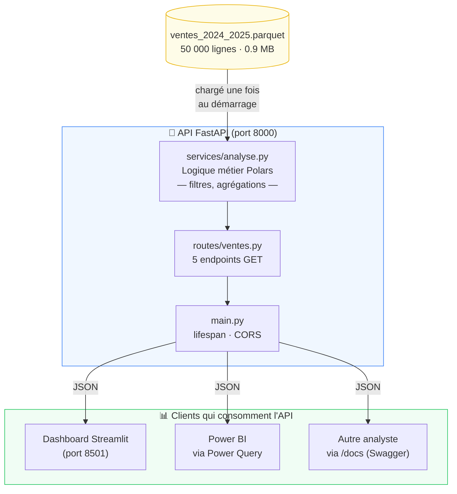

# De "je t'envoie un Excel" à "voici ton endpoint"

> Repo compagnon de la newsletter **[DataGyver #11](https://datagyver.fr)** · Stack : FastAPI · Polars · Streamlit · uv

---

## Le problème qu'on règle ici

Tu viens de finir une analyse de ventes. 50 000 lignes, 15 commerciaux, 5 régions, 2 ans d'historique.

Maintenant, plusieurs personnes en ont besoin :
- Le **contrôleur de gestion** veut l'intégrer dans son rapport Power BI
- Le **responsable commercial** veut un dashboard qu'il peut filtrer lui-même
- Un autre **analyste** veut réutiliser tes données pour un autre modèle

**Ce qui se passe aujourd'hui :**

```
Toi → export Excel → email → destinataire A
Toi → export Excel (filtré autrement) → email → destinataire B
Destinataire A → "le fichier d'hier était le bon ?"
Toi → re-export avec les corrections → email → tout le monde
```

**Le résultat :**
- 3 versions du fichier qui circulent, personne ne sait laquelle est à jour
- À chaque demande de filtre différent, c'est toi qui rouvres Excel
- Le contrôleur de gestion doit re-importer manuellement chaque lundi
- Si tu corriges une erreur dans les données sources, il faut re-envoyer à tout le monde

---

## Ce que change une API

Une API, c'est simplement **une adresse web qui répond avec des données à jour**.

```
Toi → tu poses les données une fois sur un serveur
Tout le monde → appelle l'adresse → obtient toujours la dernière version
```

Plus d'emails. Plus de "c'est quelle version le bon fichier ?". Plus de re-exports manuels.

### Les gains concrets

| | Fichier Excel partagé | API |
|---|---|---|
| **Mise à jour des données** | Re-export + renvoi manuel | Automatique, instantané |
| **Nombre de "versions" en circulation** | Incontrôlable | 1 seule, toujours à jour |
| **Temps analyste/semaine** (estimé) | 2–3h de re-exports et réponses | ~0h |
| **Connexion Power BI** | Import manuel chaque lundi | Refresh automatique |
| **Filtre à la demande** | Tu le fais à leur place | Chacun filtre lui-même via l'URL |
| **Erreur dans les données sources** | Re-envoi à tout le monde | Corrige une fois, propagé partout |
| **Audit / traçabilité** | Qui a modifié quoi ? Mystère | Chaque appel est loggable |

> **Exemple concret :** le contrôleur de gestion colle cette URL dans Power BI une seule fois :
> `http://monserveur/api/v1/ventes/par-region?annee=2025`
> Dès lors, chaque ouverture de son rapport récupère les données fraîches. Sans toi.

---

## Architecture du projet



**Le principe :** les données sont chargées **une seule fois en mémoire** au démarrage. Chaque requête filtre ce DataFrame en quelques millisecondes — sans re-lire le disque, sans re-calculer depuis zéro.

---

## Les choix techniques expliqués simplement

### Polars plutôt que pandas

Polars est une bibliothèque de traitement de données **3 à 10× plus rapide** que pandas sur des fichiers de taille moyenne. Elle utilise tous les cœurs du processeur en parallèle et évite les copies inutiles de données en mémoire.

Pour toi en tant qu'analyste, ça change quoi ? Une agrégation qui prenait 2 secondes en pandas prend 200ms. Sur un serveur qui répond à 50 personnes simultanément, ça compte.

### FastAPI plutôt que Flask

FastAPI génère **automatiquement la documentation interactive** (Swagger UI) à partir du code — sans écrire une ligne de doc supplémentaire. Elle intègre aussi la **validation des paramètres** : si quelqu'un passe `limit=99999`, l'API répond "paramètre invalide" sans que tu aies à coder ce contrôle.

### Le dashboard Streamlit ne lit jamais le fichier directement

Règle d'architecture : **le dashboard et l'API sont deux programmes séparés**. Le dashboard appelle l'API comme le ferait Power BI. Pourquoi cette contrainte ?

- Si demain tu changes la source de données (Parquet → base SQL → S3), le dashboard n'a pas à changer
- Tu peux déployer l'API sur un serveur et le dashboard ailleurs
- Plusieurs dashboards ou outils peuvent consommer la même API sans dupliquer la logique

### 5 appels en parallèle au chargement du dashboard

Au lieu de charger les KPIs, puis les graphiques, puis le tableau les uns après les autres (5 × 100ms = 500ms), le dashboard lance les 5 requêtes **en même temps** (ThreadPoolExecutor) et attend la plus lente. Résultat : ~100ms au lieu de ~500ms.

### Cache à 3 niveaux dans Streamlit

| Niveau | Mécanisme | Ce que ça évite |
|---|---|---|
| Session HTTP persistante | `@st.cache_resource` | Réouvrir une connexion TCP à chaque clic |
| Résultats API | `@st.cache_data(ttl=300)` | Re-appeler l'API si les filtres n'ont pas changé |
| Section "Top clients" | `@st.fragment` | Recharger tout le dashboard quand on change juste le slider |

---

## Démarrage rapide

**Prérequis :** Python 3.12+ et [uv](https://docs.astral.sh/uv/) (`pip install uv`)

```bash
git clone https://github.com/datagyver/api-pour-analystes.git
cd api-pour-analystes

just setup    # installe les dépendances
just data     # génère le dataset fictif (50 000 lignes)
just api      # lance l'API  → http://localhost:8000/docs
just dashboard  # lance le dashboard → http://localhost:8501
```

> Pas de `just` ? `pip install just` ou `cargo install just` · Ou lance directement `uv run fastapi dev src/api/main.py`

### Connecter Power BI en 3 clics

1. Power BI Desktop → **Obtenir des données** → **Web**
2. Coller : `http://localhost:8000/api/v1/ventes/par-region?annee=2025`
3. Power BI parse le JSON automatiquement en table

Pour une requête avancée (typage des colonnes, paramètre année dynamique), copie le contenu de [`assets/powerquery_example.m`](assets/powerquery_example.m) dans l'éditeur Power Query avancé.

### Endpoints disponibles

| Endpoint | Ce que ça retourne |
|---|---|
| `GET /health` | Statut de l'API + infos sur le dataset chargé |
| `GET /api/v1/ventes` | Transactions filtrables (région, catégorie, année, limit) |
| `GET /api/v1/ventes/par-region` | CA total, nb ventes, % du CA par région |
| `GET /api/v1/ventes/par-categorie` | CA par catégorie (Logiciel, Consulting…) |
| `GET /api/v1/ventes/top-clients` | Top N clients par CA |
| `GET /api/v1/ventes/evolution` | CA mensuel — prêt pour un line chart |

---

## Structure du projet

```
.
├── data/generate_data.py     # Génère le dataset fictif reproductible
├── src/
│   ├── api/
│   │   ├── main.py           # Point d'entrée (lifespan, CORS, router)
│   │   ├── routes/ventes.py  # Les 5 endpoints, params validés par Pydantic
│   │   ├── services/analyse.py  # Toute la logique Polars, zéro dépendance FastAPI
│   │   └── models/schemas.py    # Modèles de données (réponses + query params)
│   └── dashboard/app.py      # Dashboard Streamlit — consomme l'API uniquement
├── tests/test_api.py         # 9 tests d'intégration (pytest + httpx)
└── assets/powerquery_example.m  # Requête Power Query prête à l'emploi
```

---

## Pour aller plus loin

Ce projet est une base volontairement simple. En production, les étapes suivantes seraient :

- **Authentification** : ajouter une API key ou OAuth2 pour ne pas exposer les données publiquement
- **Déploiement** : Docker + un service cloud (Railway, Render, ou une VM) pour que l'URL soit accessible hors de ton poste
- **Source de données réelle** : remplacer le Parquet par une connexion à ta base SQL ou ton data warehouse — une seule ligne à changer dans `services/analyse.py`
- **Monitoring** : loguer chaque appel pour savoir qui utilise quoi

---

*Réalisé pour la newsletter [DataGyver](https://datagyver.fr) · Licence MIT*
